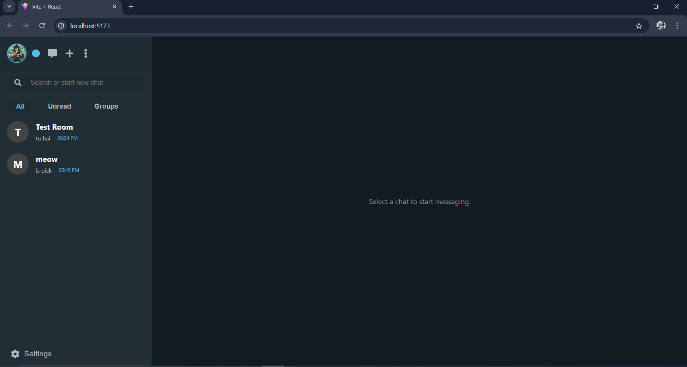
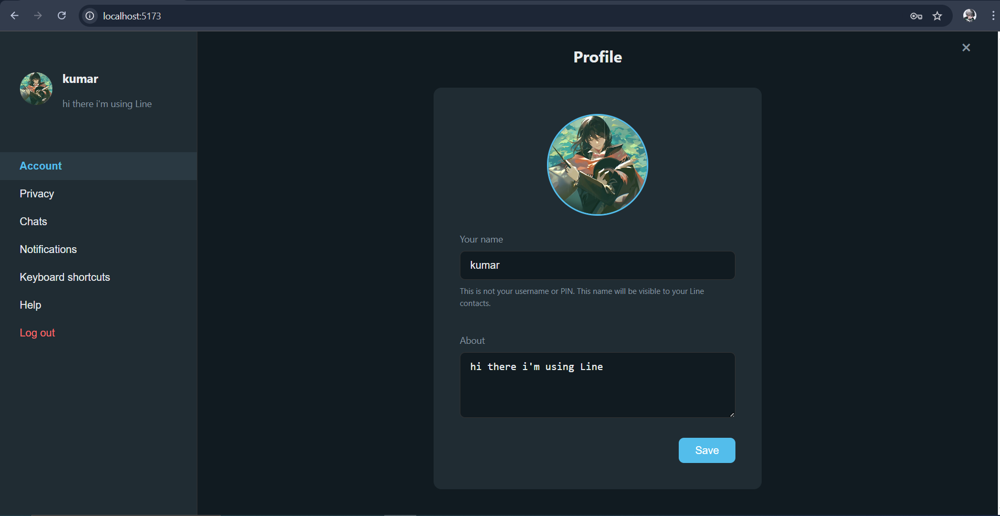
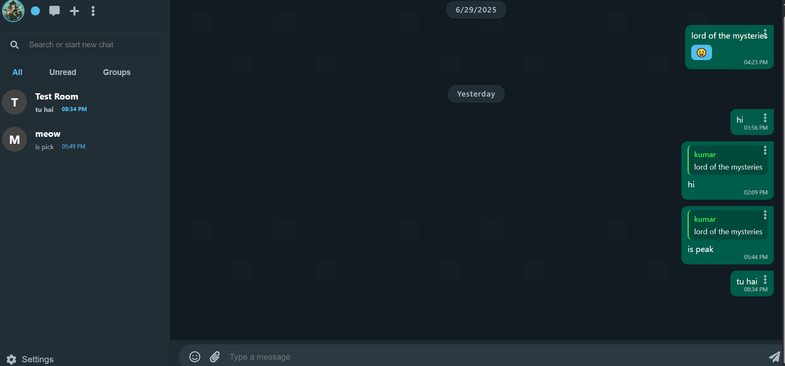
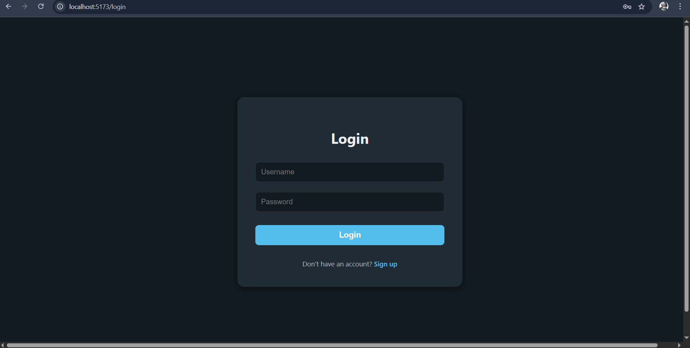
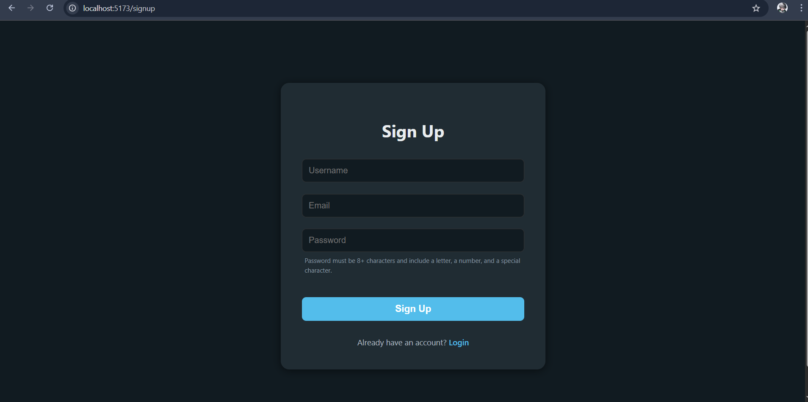

# Line - Chat Application

A modern WhatsApp-inspired chat application clone built with React (frontend) and Go (backend). Features real-time messaging, group chats, user authentication, and a sleek dark UI. (Work in progress – some features may not work as intended yet.)

---

## Features
- User signup/login (JWT)
- Real-time chat (WebSocket)
- Group & private rooms
- Typing and presence indicators
- File/image upload
- Responsive, clean UI

---

## Setup

### 1. Backend
- Install Go and MongoDB
- `cd backend`
- `go mod tidy`
- `go run main.go`
- (Optional) Create `.env` with `MONGO_URI` and `MONGO_DB`

### 2. Frontend
- `cd frontend`
- `npm install`
- `npm start`

---

## Usage
- Open [http://localhost:3000](http://localhost:3000)
- Signup, login, and chat in real time!

---

## Folder Structure
- `backend/` Go + Gin server, MongoDB models, WebSocket, REST API
- `frontend/` React app, Context, hooks, vanilla CSS

---

## Notes
- WebSocket endpoint: `ws://localhost:8080/ws?token=<JWT>`
- REST API: see backend code for endpoints
- File uploads are stored in `backend/storage/uploads/`
- For production, use HTTPS and secure JWT secret

---

## Screenshots

### Chat List & Main UI

### Profile Settings

### Chat Window

### Login Page

### Signup Page

---

## License
MIT

> **Note:** This website is currently **incomplete**. Some features are not working as intended. I plan to fix these issues and add more features in the near future. Thank you for your understanding!

Feel free to explore the codebase and contribute or provide feedback!
